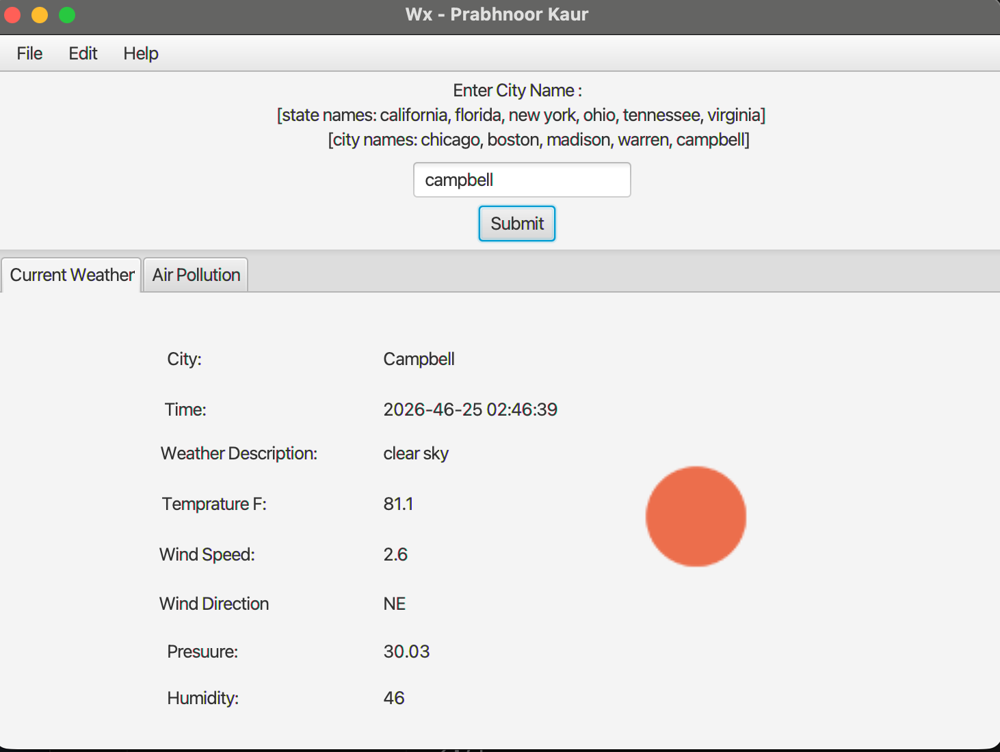

# Java Weather Dashboard

A desktop weather application built with **Java and JavaFX** that retrieves real-time weather and air-quality data using the **OpenWeather API**.

Originally developed as a course project and later updated with Maven project structure, environment-based API configuration, and improved dependency management.

## Features

- Search for current weather conditions by location
- Display temperature and weather conditions
- Display wind speed and direction
- Display atmospheric pressure and humidity
- Retrieve air-quality data and pollutant measurements
- Interactive JavaFX desktop interface
- OpenWeather API integration
- Secure API-key configuration using environment variables

## Tech Stack

- **Language:** Java 17
- **UI:** JavaFX, FXML
- **API:** OpenWeather API
- **JSON Processing:** Gson
- **Build & Dependency Management:** Maven

## Application Preview

### Current Weather



### Air Quality


## Project Structure

```text
java-weather-dashboard/
├── src/
│   └── main/
│       ├── java/
│       │   └── files/
│       │       ├── WxMain.java
│       │       ├── WxController.java
│       │       └── WxModel.java
│       └── resources/
│           ├── WxView.fxml
│           └── badzipcode.png
├── screenshots/
│   ├── current-weather.png
│   └── air-quality.png
├── .gitignore
└── pom.xml
```

## Architecture

The application follows a Model-View-Controller style structure:

- **WxMain** — launches the JavaFX application and loads the interface.
- **WxController** — handles user interaction and updates the interface with weather and air-quality information.
- **WxModel** — communicates with the OpenWeather API and processes returned JSON data.
- **WxView.fxml** — defines the JavaFX user interface.

## Running Locally

### 1. Clone the repository

```bash
git clone https://github.com/pkdhillon/java-weather-dashboard.git
cd java-weather-dashboard
```

### 2. Configure the OpenWeather API key

Create an API key through OpenWeather and set it as an environment variable:

```bash
export OPENWEATHER_API_KEY="your_api_key"
```

The application accesses the key using:

```java
System.getenv("OPENWEATHER_API_KEY");
```

API keys are not stored in the repository.

### 3. Build the project

```bash
mvn clean compile
```

### 4. Run the application

```bash
mvn javafx:run
```

## Project Background

This application was originally developed as a course project to practice Java application development, API integration, JSON processing, and graphical user interfaces.

The project was later reorganized into a Maven structure and updated to use environment variables for API credentials.
